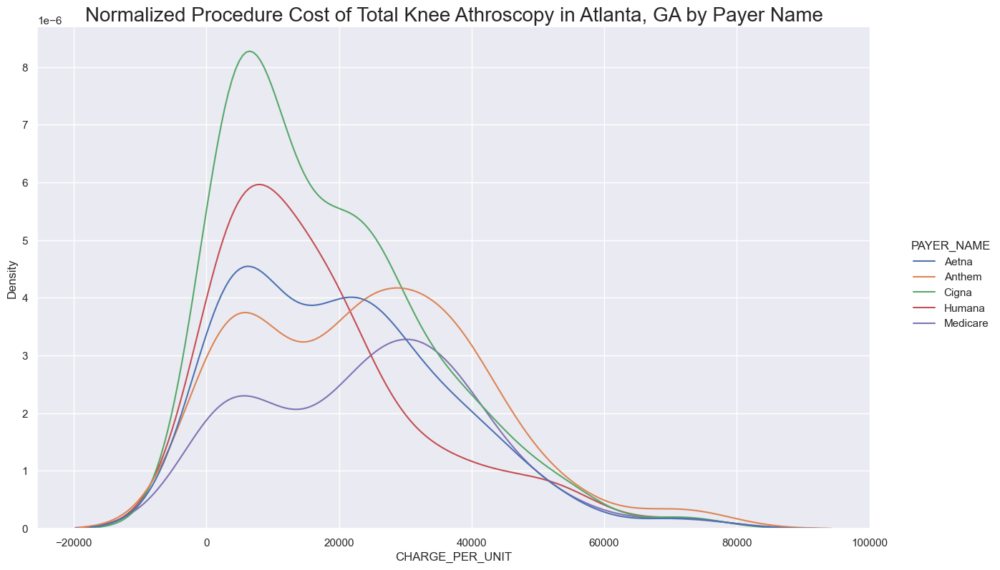
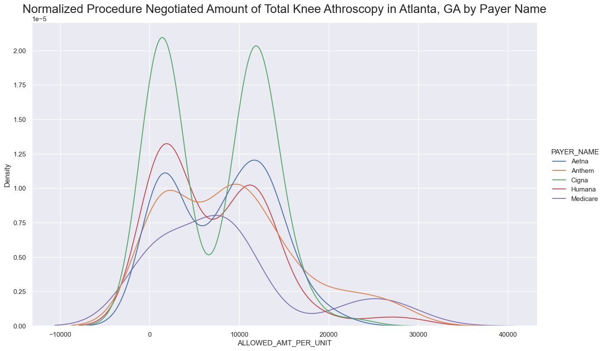

# PRI Data Exploration and Product Proposal

This repository will explore the LN cost data and conclude with a proposal for a data product.

**1. What's in the data?**

**2. What have we found?**

While there is a wealth of interesting data points and directions to go with this data, a few interesting things we found immediately were: 

        a. Distributions by payer 
        
        

        